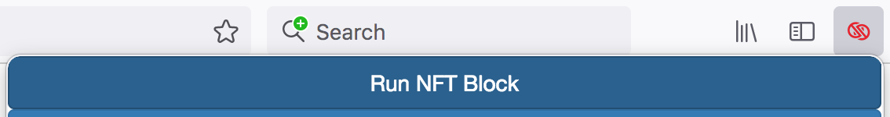
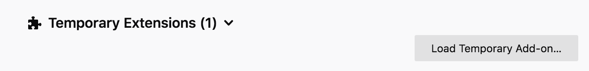
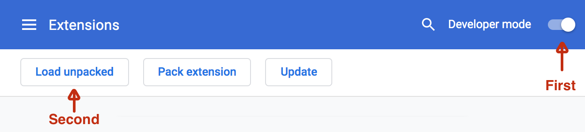

**Warning: Twitter monitors accounts for automated activity. This plugin is literally automated activity and may trip Twitter's bot detection. If you use this plugin, you will probably be required at some point to give Twitter your phone number to prove you are not a bot.** If after performing a mass block you find Twitter pages are no longer loading, try deleting your cookie, rebooting your browser and re-logging in.

**Instead of using this browser plugin,** I recommend Better Tweetdeck, NoFT, or the AntsStyle blocker, all of which avoid this problem. [See this page for more information](https://github.com/mcclure/NFTBlocker/).

## What is this?

This is a browser plugin that blocks people who use Twitter's NFT integration.

## What's an "NFT"?

Investment scam.

## Why would you want to block NFT users?

Three reasons.

1. Because it is designed in a foolish way, the NFT system has a shocking amount of impact on global warming. The more demand there is to buy and sell NFTs, the higher the value of energy-wasting ("proof of work") cryptocurrencies goes and the more coal and oil these networks will burn. I don't want to be in a community with people who support that.

2. The NFT market is rife with scams and art theft.

3. In short, NFT users are just irritating to be around. People who bought NFTs have to keep hyping other people to buy NFTs or the NFTs they bought will lose value. Twitter NFT cliques are rife with sockpuppet accounts, dogpiling and indifferentiable monkey clones. Blocking NFT users just makes Twitter nicer.

## How does this work?

Twitter has a feature (currently in closed beta) where you can showcase an NFT in your profile. Probably they decided to do this because Jack Dorsey, who left the company shortly after the feature was announced, was invested in cryptocurrency and if Twitter makes NFTs more popular, Jack Dorsey will make money.

This is a Firefox plugin that detects that feature in use. It adds a menu that you can use on a "Follower" or "Following" page:

If you select this, everyone on the page with the beta "NFT avatar" flag will be blocked.

This is an early prototype. Future versions of this plugin will scan your notifications and do the blocking automatically.

## How do I install this?

You need the file `blockchain.zip`. Download a blockchain.zip from the "releases" button to the right of this text. →

Optionally, if you know what this means, you can build it yourself by running:

	npm install
	npx bower install
	npx grunt build-chrome

### Installing in Firefox

Once you have the zip file, go to `about:debugging#/runtime/this-firefox` in the Firefox URL bar. Click "load temporary add-on" and select blockchain.zip. Warning, **installing extensions this way is dangerous**. If I were evil, the blockchain.zip I uploaded could be stealing your passwords or credit card numbers. Don't install extensions this way unless you trust the source.

### Installing in Chrome

For Chrome you will need to unzip the zip file. On Mac double-click blockchain.zip, or on Windows right-click and say "extract all".

Now go into Chrome and enter `chrome://extensions/` into the URL bar. Click to turn on "Developer mode", then click "Load unpacked". Select the "blockchain" directory you just made.

Again, **installing extensions this way is dangerous**, which is why Google makes you jump through hoops. A future version of this plugin will hopefully be available on the Chrome/Firefox app store. Again, may I recommend [other, newer apps that do the same thing](https://github.com/mcclure/NFTBlocker/).

## How can I help?

If you know anything about browser plugins or Twitter-hacking, PRs are appreciated. The project's TODO list is [here](PLAN.md).

# About Twitter Block Chain

NFTBlocker is a fork of the [Twitter Block Chain](https://github.com/ceceradio/twitter-block-chain) plugin.